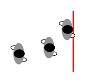
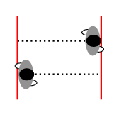
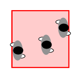

.. _methods:
====================
Measurement methods
====================

.. _method_A:
Method A
========

   Method A: Illustration of the measurement line.

A reference line is taken and studied over a fixed period of time :math:`\Delta {t}`.
Using this method we can obtain the pedestrian flow :math:`J` and the velocity :math:`v_i` of each pedestrian passing the reference line directly. \
Thus, the flow over time :math:`\langle J \rangle_{\Delta t}` and the time mean velocity :math:`\langle v \rangle_{\Delta t}` can be calculated as

.. math::

    \langle J \rangle_{\Delta t}=\frac{N^{\Delta t}}{t_N^{\Delta t} - t_1^{\Delta t}}\qquad \text{and} \qquad \langle v \rangle_{\Delta t}=\frac{1}{N^{\Delta t}}\sum_{i=1}^{N^{\Delta t}} v_i(t),

where :math:`N^{\Delta t}` is the number of persons passing the reference line during the time interval :math:`\Delta {t}`.

:math:`t_N^{\Delta {t}}` and :math:`t_1^{\Delta {t}}` are the times when the first and last pedestrians pass the location in :math:`\Delta {t}`.

.. note::
    This time period can be different from :math:`\Delta {t}`.

The time mean velocity :math:`\langle v \rangle_{\Delta t}` is defined as the mean value of the instantaneous velocities :math:`N^{\Delta t}` pedestrians.

:math:`v_i(t)` is calculated by use of the displacement of pedestrian :math:`i` in a small time interval :math:`\Delta t^\prime` around :math:`t`:

.. math::

    v_i(t)=\frac{\vec{x_i}(t+\Delta t^\prime/2)-\vec{x_i}(t-\Delta t^\prime/2))}{\Delta t^\prime}.

.. _method_B:
Method B
========

The spatial mean velocity and density are calculated by taking a segment :math:`\Delta x` in a corridor as the measurement area.

   Method B: Illustration of the measurement interval.

The velocity :math:`\langle v \rangle_i` of each person is defined as the length :math:`\Delta x` of the measurement area divided by the time they need to cross the area:

.. math::

    \langle v \rangle_i=\frac{\Delta x}{t_\text{out}-t_\text{in}},

where :math:`t_\text{in}`and :math:`t_\text{out}` are the times a person enters and exits the measurement area, respectively.
The density :math:`\rho_i` for each person :math:`i` is calculated as:

.. math::

    \langle \rho \rangle_i=\frac{1}{t_\text{out}-t_\text{in}}\cdot\int_{t_\text{in}}^{t_\text{out}} \frac{N^\prime(t)}{b_\text{cor}\cdot\Delta x}dt,

where :math:`b_\text{cor}` is the width of the measurement area while :math:`N^\prime(t)` is the number of person in this area at a time :math:`t`.

.. _method_C:
Method C
========

   Method C: Illustration of the measurement area

The density :math:`\langle \rho \rangle_{\Delta x}` is defined as the number of pedestrians divided by the area of the measurement section:

.. math::

    \langle \rho \rangle_{\Delta x}=\frac{N}{b_\text{cor}\cdot\Delta x}.

The spatial mean velocity is the average of the instantaneous velocities :math:`v_i(t)` for all pedestrians in the measurement area at time :math:`t`:

.. math::

    \langle v \rangle_{\Delta x}=\frac{1}{N}\sum_{i=1}^{N}{v_i(t)}.

.. _method_D:
Method D
========

At any time the positions of the pedestrians can be represented as a set
of points, from which the Voronoi diagram can be generated.

The Voronoi cell area, :math:`A_i`, for each person :math:`i` can be obtained.

.. figure:: images/jpsreport_Method_D.png
   :alt: Method D: Illustration of the Voronoi diagrams

   Method D: Illustration of the Voronoi diagrams

Then, the density and velocity distribution of the space :math:`\rho_{xy}` and :math:`v_{xy}` can be defined as

.. math::

    \rho_{xy} = 1/A_i \quad \text{and} \quad v_{xy}={v_i(t)}\qquad \mbox{if} (x,y) \in A_i,

where :math:`v_i(t)` is the instantaneous velocity of each person.

The **Voronoi density** for the measurement area is defined as:

.. math::

    \langle \rho \rangle_v=\frac{\iint{\rho_{xy}dxdy}}{b_\text{cor}\cdot\Delta x}.

For a given trajectory :math:`\vec{x_i}(t)`, the velocity :math:`v_i(t)` is calculated by use of the displacement of pedestrian :math:`i` in a small time interval :math:`\Delta t^\prime` around :math:`t`:

.. math::

    v_i(t)=\frac{\vec{x_i}(t+\Delta t^\prime/2)-\vec{x_i}(t-\Delta t^\prime/2))}{\Delta t^\prime}.

For calculating the mean velocity in the measurement area two approaches
can be applied.

1. The **Voronoi velocity** is defined as:

.. math:: \langle v \rangle_v=\frac{\iint{v_{xy}dxdy}}{b_\text{cor}\cdot\Delta x}.

2. The **Arithmetic velocity** is the average of the instantaneous
   velocities :math:`v_i(t)` for all pedestrians :math:`N` who have an intersection with the measurement area at the time :math:`t`:

.. math::

    \langle v \rangle_{\Delta x}=\frac{1}{N_{(x,y) \in A_i}}\sum_{i=1}^{N_{(x,y) \in A_i}}{v_i(t)}.
