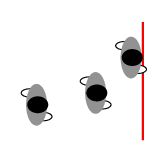
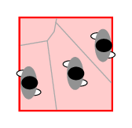

.. _usage:
================================
Getting started with jpsreport
================================

``jpsreport`` is a command line module to analyze trajectories of pedestrians.
In the terminal, pass an ini-file file as argument.

The following pictures summarizes the input and output files of ``jpsreport``

   Definition of input and output files of jpsreport

Three input files are required to run ``jpsreport``:

-  A :ref:`Configuration/ini-file<Configuration/ini-file>`: This ini-file gives some
   information related to each measurement method. e. g. the location of
   measurement areas, the chosen measurement method, etc. This file
   should be in ``.xml`` format.
-  A :ref:`Trajectory file<Trajectory-file>`: Pedestrian’s 3D
   position information over time. Only ``.txt`` format is supported.
   The file must contain the data sorted by time/frames.
-  A :ref:`Geometry file<Geometry-file>`: Geometry for a certain
   trajectory data. This file should be in ``.xml`` format.

Usage
=====

To start an analysis, run ``jpsreport`` in a terminal.
It is suggested to redirect the output of the analysis to a file, to persist any warnings which may occur during the analysis.
This can be done by:

.. code:: bash

   ./jpsreport <path_to_inifile> > log_example.txt

Configuration/ini-file
======================

In the configuration/ini-file, the following sections should be defined:

Header
------

.. code:: xml

     <?xml version="1.0" encoding="UTF-8" ?>
     <JPSreport project="JPS-Project" version="0.8" xmlns:xsi="http://www.w3.org/2001/XMLSchema-instance" >

Geometry
--------

indicates the file name corresponding to the trajectory files to
analyze.

.. code:: xml

      <geometry file = "geo_KO_240_050_240.xml" />

The location can be either absolute path or relative path to the
location of the inifile. A path is considered absolute if it starts with
“/” (Linux system) or contains “:” (Windows system).

.. code:: xml

      <geometry file = "geo/geo_KO_240_050_240.xml" />

Output
------

indicates the location of the output files based on the location of
inifile or the absolute path.

.. code:: xml

      <output location="Output/"/>

A path is considered absolute if it starts with “/” (Linux system) or
contains “:” (Windows system).

Trajectories
------------

indicates the location and the name of the trajectory files that will be
analyzed. The format of trajectory files should be ``.txt``.

The supported unit of the trajectories is ``m``. Two other sub-options
``file`` and ``path`` can be supplied. If only ``path`` is given, then
all files with the corresponding format in the given folder will be
considered as the upcoming trajectories and ``JPSreport`` will try to
load them one by one. If ``path``\ is not defined, the trajectory files
must be located in the same directory as the inifile. If both ``file``
and ``path`` are given, then only the given trajectories will be
considered (several ``file`` tags can be given at the same time).

The location can be either absolute path or relative path to the
location of the inifile. A path is considered absolute if it starts with
“/” (Linux system) or contains “:” (Windows system).

For example:

.. code:: xml

   <trajectories format="txt" unit="m">
       <file name="traj_KO_240_050_240.txt" />
       <file name="traj_KO_240_060_240.txt" />
       <path location="./" />
   </trajectories>

.. warning::

   To avoid issues when creating the output files, to not define path information in ``file`` as in

   .. code:: xml

       <trajectories format="txt" unit="m">
           <file name="data/traj.txt" />
       </trajectories>

   .

Measurement area
----------------

Indicates the types and location of the measurement areas you plan to
use for analysis. Mainly two kind of measurement areas can be defined:

-  ``area_B``: a 2D area and can be polygon (**the orientation of its
   points is clockwise**)
-  ``area_L``: a reference segment line defined by two points.

``area_L`` is only used in method A, while ``area_B`` is used for method
B, method C and method D. Several measurement areas can be given and
distinguished with different ``id``. Measurement areas must be defined
within one room according to the geometry file. They should not spread
over several rooms or cross with walls.

The parameter ``zPos`` is used to indicate the position of measurement
area in z axis. ``zPos`` is useful for geometry with several stories.



.. code:: xml

   <measurement_areas unit="m">
       <area_B id="1" type="BoundingBox" zPos="None">
           <vertex px="-2.40" py="1.00" /> <!-- Clockwise -->
           <vertex px="-2.40" py="3.00" />
           <vertex px="0" py="3.00" />
           <vertex px="0" py="1.00" />
           <length_in_movement_direction distance="2.0" />
       </area_B>
       <area_L id="2" type="Line" zPos="None">
           <start px="-2.40" py="1.00" />
           <end px="0" py="1.00" />
       </area_L>
       <area_L id="3" type="Line" zPos="None">
           <start px="-2.40" py="2.00" />
           <end px="0" py="2.00" />
       </area_L>
   </measurement_areas>

Velocity
--------

precises the method for calculating the instantaneous velocity :math:v_i(t) of pedestrian :math:i at time :math:t from trajectories:

.. math::

     v_i(t) = \frac{X(t+\frac{frame\_step}{2}) - X(t-\frac{frame\_step}{2})}{frame\_step}.

.. code:: xml

     <velocity frame_step="10" set_movement_direction="None"
               ignore_backward_movement="false"/>

Possible parameters are

- ``frame_step`` gives the size of time interval for calculating the velocity. The default value is 10.
- ``set_movement_direction`` indicates in which direction the velocity will be projected. The value of ``set_movement_direction`` can be:

  - ``None``, which means that you don’t consider the movement direction and calculate the velocity by the real distance. This is the default value.
  - Any real number from ``0`` to ``360`` which represents the angular information of the direction in the coordination system. Note that the axis can be represented either by ``X+``, ``Y+``, ``X-``, ``Y-`` or by 0, 90, 180, 270.
  - ``SeeTraj``. For complex trajectories with several times of direction change, you can indicate the detailed direction using the angular information in the trajectory file (By adding a new column in ``.txt`` file with the indicator ``VD``).
-  ``ignore_backward_movement`` indicates whether you want to ignore the movement opposite to the direction from ``set_movement_direction``. The default value is ``false``.

Methods
-------

Indicates the parameters related to each measurement method.
Four different methods ``method_A`` to ``method_D`` are integrated in the current version of ``JPSreport`` and can be chosen for the analysis.
They are used to analyze the movement of pedestrians for the steady state.
Additionally, ``Method_D`` can be used for time-series analysis of individual data.

+-----------------------+-----------------------+------------------------------------------------------------------------------------+
| Method                | measurement area      | output data                                                                        |
+=======================+=======================+====================================================================================+
| *A*                   | |Method A|            | :math:`\langle v \rangle_{\Delta t}` and  :math:`\langle J \rangle_{\Delta t}`     |
+-----------------------+-----------------------+------------------------------------------------------------------------------------+
| *B*                   | |Method B|            | :math:`\langle v \rangle_i` and :math:`\langle \rho \rangle_i`                     |
+-----------------------+-----------------------+------------------------------------------------------------------------------------+
| *C*                   | |Method C|            | :math:`\langle v \rangle_{\Delta x}` and :math:`\langle \rho \rangle_{\Delta x}`   |
+-----------------------+-----------------------+------------------------------------------------------------------------------------+
| *D*                   | |Method D|            | :math:`\langle v \rangle_v` and :math:`\langle \rho \rangle_v`                     |
+-----------------------+-----------------------+------------------------------------------------------------------------------------+

Further information relating to each method can be found in `Pedestrian
fundamental diagrams: Comparative analysis of experiments in different
geometries <http://hdl.handle.net/2128/4898>`_.

Method A
""""""""

For definition see :ref:`Method A <method_A>`.
Method A is used to analyze the steady state.

.. code:: xml

     <method_A enabled="true">
       <measurement_area id="2" frame_interval="100"/>
       <measurement_area id="3" frame_interval="100"/>
     </method_A>

Possible parameters are:

   - ``id`` specifies the location of the reference line.
   - ``frame_interval`` specifies the size of time interval (in *frame*) for calculating flow rate.

Possible output data are:

   - ``/Fundamental_Diagram/FlowVelocity/``:

       - ``Flow_NT_traj_``: containing  Frame, time and cumulative pedestrians
       - ``FDFlowVelocity_traj_``

Method B
""""""""

For definition see :ref:`Method B <method_B>`.
Method B is used to analyze the steady state.

.. code:: xml

     <method_B enabled="false">
         <measurement_area id="1" />
     </method_B>

This method can only be used to analyze one directional (or part of one directional) pedestrian movement in corridors.
The speed is defined by the length of the measurement area ``length_in_movement_direction`` and the time a pedestrian stays in the area.

Possible parameters are:

  - ``measurement_area`` given by an ``id`` number. Note that the measurement area for method_B should be rectangle based on the definition of the method.

Possible output data are:

  - ``/Fundamental_Diagram/TinTout/``: output file ``FDTinTout_traj_`` with mean density and velocity of each pedestrians: PersID, :math:`\rho_i` and :math:`v_i`.

Method C
""""""""

For definition see :ref:`Method C <method_C>`.
Method C is used to analyze the steady state.

.. code:: xml

     <method_C enabled="true">
         <measurement_area id="1"/>
     </method_C>

Possible parameters are:

-  ``id`` indicates the size and location of the measurement_area.
   Several measurement areas can be set in one inifile.

Possible output data are:

   - ``/Fundamental_Diagram/Classical_Voronoi/``: output file ``rho_v_Classic_traj_`` with mean density and velocity of over time (frame, :math:`rho(t)`, :math:`v(t)`).

Method D
""""""""

For definition see :ref:`Method D <method_D>`.
Method D is used to analyze velocity and density in the steady state as well as for time-series analysis.

.. code:: xml

    <method_D enabled="true">
      <measurement_area id="1" start_frame="None" stop_frame="None"
            local_IFD="false"/>
      <one_dimensional enabled="false"/>
      <global_IFD enabled="true"/>
      <cut_by_circle enabled="false" radius="1.0" edges="10"/>
      <profiles enabled="false" grid_size_x="0.20" grid_size_y="0.20"/>
      <use_blind_points enabled="true"/>
      <vel_calculation type="Voronoi"/>
    </method_D>

Possible parameters are:

-  For each ``measurement_area``, several id numbers can be set in one ini-file.

- ``start_frame`` and ``stop_frame`` give the starting and ending frame for data analysis.
  The default values of these two parameters are ``None``.
  If you plan to analysis the whole run from beginning to the end, set both of ``start_frame`` and ``stop_frame`` as ``None``;
  If ``start_frame =None`` but ``stop_frame`` is not, then analysis will be performed from beginning of the trajectory to the ``stop_frame``.
  If ``start_frame`` is not ``None`` but ``stop_frame = None``, it will analyze from the ``start_frame`` to the end of the movement.

- ``local_IFD`` determines whether or not to output the data for individual fundamental diagram in the given measurement area,
  which is based on the Voronoi density :math:\rho_i, velocity :math:v_i, position (:math:`x_i`, :math:`y_i`, :math:`z_i`)
  and Voronoi polygon of each pedestrian :math:i in a given measurement area but not mean value over space.
  If ``true`` the related data will be written in the folder ``./Output/Fundamental_Diagram/IndividualFD/``.

- ``one_dimensional`` should be used when pedestrians move on a line `single-file experiment <http://www.asim.uni-wuppertal.de/datenbank/own-experiments/corridor/1d-single-file-no-2.html>`.

- ``cut_by_circle`` determines whether to cut each cell by circle or not.
  Two options ``radius`` of the circle and the number of ``edges`` have to be supplied for approximating the circle if ``enabled`` is ``true``.

- ``profiles`` indicates whether to calculate the profiles over time and space.
  If ``enabled`` is true, the resolution which is decided by the parameters ``grid_size_x`` and ``grid_size_x`` should be set.
  ``start_frame`` and ``stop_frame`` can be used to specify the time range for the analysis.

- ``global_IFD`` indicates a global measurement area encompassing the entire geometry for which individual data (IFD) are calculated. \
  This parameter is set to ``false`` by default.
  ``start_frame`` and ``stop_frame`` can be used to specify the time range for the analysis.

- ``use_blind_points`` allows to calculate Voronoi cells in measurement areas even if less than four pedestrians are present.
  This is realized with the help of blind points are automatically defined outside the geometry.
  This parameter is set to ``true`` by default.

- ``vel_calculation`` indicates the approach that is used for the velocity calculation.
  By default the ``Voronoi`` approach is chosen but it can be changed to ``Arithmetic`` if needed.
  See :ref:`Method D <method_D>` for details.

Possible output data are:

- ``/Fundamental_Diagram/Classical_Voronoi/``:

  - ``rho_v_Voronoi_[velocity_calculation_type]_[filename.txt]_id_[local_measurement_area_id].dat``:
    with mean density and velocity over time (frame, :math:\rho_i, :math:v_i )

- ``/Fundamental_Diagram/IndividualFD/``:
   - ``IFD_local_[filename.txt]_id_[local_measurement_area_id].dat`` contains data for each pedestrian :math:i
     (in the measurement area) about individual Voronoi density :math:\rho_i,
     individual velocity :math:v_i ,
     position (:math:`x_i`, :math:`y_i`, :math:`z_i`),
     Voronoi polygon of the pedestrian and
     the intersection of the Voronoi polygon with the measurement area.

   - ``IFD_global_[filename.txt].dat`` contains data for each pedestrian :math:i
     about individual Voronoi density :math:\rho_i,
     individual velocity :math:v_i ,
     position (:math:`x_i`, :math:`y_i`, :math:`z_i`),
     Voronoi polygon of the pedestrian.

- ``./Output/Fundamental_Diagram/Classical_Voronoi/field/``:
  - ``Profile_rho_Voronoi_[filename.txt]_[frame]`` contains the profile data for density for one frame.

  - ``Profile_v_[velocity_calculation_type]_[filename.txt]_[frame]`` contains the profile data for velocity for one frame.
  - the output folder ``./Output/Fundamental_Diagram/Classical_Voronoi/VoronoiCell/`` contains the data for plotting the Voronoi cells.

.. |Method B| image:: images/jpsreport_Method_B.png
.. |Method C| image:: images/jpsreport_Method_C.png

Trajectory-file
===============

Trajectory files which can be analyzed with ``JPSreport`` need a specific format.
It is the same format which is generated by simulations with ``jpscore``, see `JupedSim documentation <https://www.jupedsim.org/jpscore_trajectory.html>`_ for more information.

Geometry-file
==============

As ``JPSreport`` is part of JuPedSim the same geometry model is used for the analysis, on how to create such geometries see `JupedSim documentation <https://www.jupedsim.org/jpscore_geometry.html>`_.
